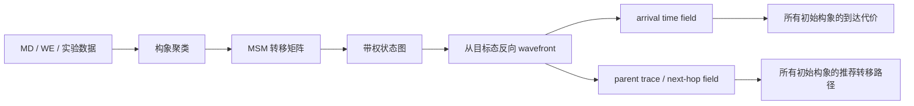

# 蛋白质构象转移与药物结合路径场：面向 Wavefront 复用的综述

## 摘要

这个方向可以理解为：把蛋白质或蛋白质-配体系统的“构象空间”建成一个大图，图中的节点是稳定或半稳定的分子状态，边表示状态之间可能发生的跃迁，边权表示跨越能垒、平均首次到达时间、负对数跃迁概率或其他动力学代价。传统分子动力学和 Markov state model 已经在做“从大量短轨迹中恢复长时间尺度动力学”的工作；你的 wavefront/SNN 方法可以进一步把这个图看成一个可传播的动力学场：从目标构象或目标结合态发放一次 wavefront，就能得到许多初始构象到目标态的全局 next-hop field。

这种场景比城市导航更科学化，因为它对应药物设计、蛋白质变构调控、折叠/错折叠、配体结合路径、酶催化构象转移等真实问题。它和你已经验证的“多用户共享同一目标场”非常契合：许多分子初始构象、许多突变体、许多配体候选姿态，都可能共享同一个目标态，例如 active state、bound state、native state 或 misfolded toxic state。

## 直观图像：蛋白质不是静态结构，而是在能量地形中运动


图源：[Wikimedia Commons: Folding funnel schematic](https://commons.wikimedia.org/wiki/File:Folding_funnel_schematic.svg)。该图用“漏斗”表示蛋白质折叠能量地形：上方是大量高熵、未折叠构象，下方是低自由能的 native state。真实蛋白质并不是沿一条固定路线折叠，而是在高维构象空间中通过许多可能路径逐步走向稳定区域。

对计算机专业来说，可以把这个过程类比为一个带权有向图上的随机过程：

- 节点：一个构象簇、一个 metastable state、一个配体结合姿态、一个变构状态。
- 边：在分子动力学轨迹中观察到的状态跳转，或理论上允许的构象变化。
- 边权：自由能势垒、跃迁等待时间、`-log P(i->j)`、平均首次到达时间、反应动作量。
- 目标：native state、active state、bound state、unbound state、错误折叠状态。
- 查询：从很多起点构象到同一目标态的路径、代价和 next-hop。

## 背景：为什么这个问题难

蛋白质构象转移难在时间尺度差异。分子动力学的积分步长通常在飞秒量级，而蛋白质折叠、配体结合、通道开闭、GPCR 激活等功能事件可能发生在微秒、毫秒甚至更长时间尺度。Schwantes、McGibbon 和 Pande 在 Markov models 综述中强调，分子动力学能给出原子级轨迹，但原始轨迹本身不是结论；研究者还必须把轨迹转化为可解释、可外推的统计动力学模型。

典型难点包括：

- 状态空间维度极高：一个蛋白质有成千上万个原子，每个原子的坐标、速度和相互作用共同定义系统状态。
- 重要事件稀有：大多数时间系统只是在某个稳定 basin 内热涨落，很少真正跨越能垒。
- 路径不唯一：同一个起点和终点之间可能存在多个中间态、多条通道和多个瓶颈。
- 观测不完整：仿真轨迹有限，实验测量通常只能给出平均结构、速率或间接信号。
- 目标多样：药物设计中既关心最稳定结合姿态，也关心进入/离开结合口袋的路径、变构调控路径和副作用相关状态。

因此，现代计算生物物理通常不会只问“最短路径是什么”，而会问：

- 从一组初始构象到目标态的主要通道有哪些？
- 哪些中间态是动力学瓶颈？
- 哪些突变或配体会改变路径概率？
- 某个目标态对整个状态空间的吸引范围有多大？
- 如果有许多起点构象，能否一次性获得所有起点的推荐转移方向？

最后一个问题正是 wavefront 全局场复用的切入点。

## 现有研究主线

### 1. 分子动力学：生成状态转移样本

分子动力学模拟通过近似力场和数值积分追踪原子运动。它的优势是物理细节丰富，能够看到氢键、疏水塌缩、侧链重排、配体进入口袋等微观过程；局限是时间尺度昂贵。即使 GPU、Anton、Folding@home 这类平台大幅提升了采样能力，毫秒级或秒级稀有事件仍然非常难直接暴力采样。

从图建模角度看，分子动力学给你的不是一张图，而是一批轨迹：

```text
trajectory_1: state 3 -> state 7 -> state 9 -> state 2
trajectory_2: state 3 -> state 4 -> state 8 -> state 2
trajectory_3: state 6 -> state 7 -> state 9 -> state 2
```

后续算法需要从这些轨迹中估计“状态”和“状态之间的转移规律”。

### 2. Markov State Model：把轨迹离散成状态图

Markov state model，简称 MSM，是当前分子构象动力学中最重要的图模型之一。它把连续高维构象空间划分为有限个状态，然后估计固定 lag time 下的转移矩阵：

```text
T_ij = P(x_{t+tau} in state_j | x_t in state_i)
```

Schwantes 等人的综述将 MSM 描述为有限状态的 Markov jump process；状态间转移概率矩阵决定系统动力学。MSM 的核心价值是：用许多短轨迹估计长时间尺度过程，而不必等待一条超长轨迹直接看完整事件。

在你的 wavefront 设定里，MSM 可以自然转化为有向带权图：

- `weight(i,j) = -log T_ij`：最小化路径上的负对数概率，相当于寻找最可能路径。
- `weight(i,j) = MFPT(i,j)`：最小化预期到达时间。
- `weight(i,j) = DeltaG_barrier(i,j)`：最小化跨越自由能势垒的总代价。
- `delay(i,j)`：SNN 突触延迟，对应动力学代价。

这样，SNN wavefront 从目标态反向传播，就可形成“所有构象到该目标态的 next-hop field”。

### 3. Transition Path Theory：研究反应通量，而不只是最短路

Transition path theory，简称 TPT，研究系统从反应物集合 A 到产物集合 B 的 reactive trajectories。Cameron 和 Vanden-Eijnden 的复杂网络 TPT 工作把 TPT 用到网络流上，用来分析从一组节点到另一组节点的反应轨迹、通量管道、瓶颈和机制。

这和单条最短路不同。分子系统里，最短或最低代价路径未必代表最主要的反应通道；很多路径可能共同贡献通量。对你的方法来说，这提示了两个扩展方向：

- 基础版：用 wavefront 得到单一最小代价 next-hop field。
- 进阶版：让 wavefront 编码多条近优通道或概率通量，而不只是最短父节点。

如果论文中要强调应用合理性，可以写成：SNN wavefront 先作为最短/最低动作路径场的快速近似；将来可结合 TPT，把 spike timing 或多次传播统计解释为反应通量分布。

### 4. Weighted Ensemble 与 Milestoning：稀有事件的并行采样

Weighted ensemble 和 milestoning 都是处理稀有事件的采样方法。Ray 和 Andricioaei 的 WEM 工作将 weighted ensemble 与 milestoning 结合，用于估计自由能、相关函数和平均首次到达时间。Donovan 等人还把 weighted ensemble 应用于化学反应网络，展示它能更高效估计稀有状态概率和 mean first passage time。

这些方法与 wavefront 的关系不是“谁替代谁”，而是上下游关系：

- WE/Milestoning/MD：负责采样，估计状态图、转移概率、MFPT 或能垒。
- MSM/TPT：负责从采样数据构建动力学网络和通量解释。
- SNN wavefront：在已经构建好的网络上，快速服务大量路径查询。

所以一个合理的研究系统可以是：先用公开 MD 数据或合成势能面构建 MSM，再比较 SNN wavefront、Dijkstra、A* 在多起点/多目标查询下的复用效率。

## Wavefront 如何嵌入这个领域

设图 `G=(V,E)` 表示构象状态网络。令目标集合 `B` 是我们关心的功能态，例如活化态或稳定结合态。我们可以在反向图 `G^R` 上从 `B` 发放 wavefront：



如果有 1000 个初始构象都要查询“如何到达 bound state”，传统单对单路径规划要执行 1000 次；而 wavefront 只需针对 bound state 运行一次，然后每个初始构象沿 next-hop field 回溯即可。

更贴近论文表述的伪代码：

```text
Input:
    G: 构象状态图
    target: 目标构象态，例如 active/bound/native
    sources: 很多初始构象或配体姿态

Precompute:
    reverse_G = reverse(G)
    wavefront_result = SNN_Wavefront(reverse_G, target)
    next_hop_field = ExtractParentTrace(wavefront_result)

Query:
    for source in sources:
        path[source] = FollowNextHop(next_hop_field, source, target)
        cost[source] = wavefront_arrival_time[source]
```

## 最适合展示优势的具体问题

### 场景 A：许多初始构象共享一个活化态

研究对象可以是 GPCR、激酶、离子通道或酶。目标态是 active state，起点是大量 inactive/intermediate conformations。科学问题是：哪些初始构象最容易走向活化态？哪些中间状态是必经瓶颈？

优势点：

- 多个起点共享同一个目标态。
- 一次反向 wavefront 得到所有状态到 active state 的 next-hop。
- 可用于解释变构激活路径和药物调控位点。

### 场景 B：许多配体姿态共享一个稳定结合构象

药物分子进入蛋白结合口袋时，可能有很多初始 pose 和中间 pose。目标是稳定 bound pose。图节点可表示蛋白-配体复合物的 metastable pose，边表示 pose 转换或进入/退出通道。

优势点：

- 高通量药物筛选天然有大量候选 pose。
- SNN 可一次给出所有 pose 到稳定结合态的路径场。
- 如果某个边对应高能垒或不允许的构象变化，可以关闭突触重新发 wavefront。

### 场景 C：蛋白错折叠或聚集风险场

目标不是 native state，而是 misfolded/toxic aggregate-prone state。起点是正常构象或突变构象。问题是：哪些构象更容易进入有害 basin？

优势点：

- 与神经退行性疾病、蛋白质质量控制、伴侣蛋白机制相关。
- 多个突变体或环境条件可以共享目标风险场。
- 输出不是单条路线，而是全局风险梯度和 next-hop 倾向。

### 场景 D：多目标竞争，寻找最可能功能终点

目标集合包含 active、inactive、misfolded、degraded 等多个 terminal basins。一次多目标 wavefront 可以判断每个初始构象最先到达哪个 basin，类似“构象命运选择”。

这和你已经验证的“多目标同时搜索”一致，只是把目标从地理地点换成了分子功能态。

## 可落地的 Demo 设计

为了不需要真正做昂贵分子动力学，建议分三层做：

### 第一层：合成双井或多井势能面

用二维势能函数生成网格图：

```text
U(x,y) = 多个高斯势阱 + 势垒 + 噪声
edge_cost = exp((U_barrier - U_current) / kT)
```

目标是某个低能 basin。这个 demo 易解释、可视化强，可以展示 wavefront 如何形成全局构象路径场。

### 第二层：公开小分子系统

可选 alanine dipeptide 或小肽。它们常用于 MSM、自由能面、rare event 方法测试。节点可以是 `(phi, psi)` 二面角空间的离散 bin，目标是某个稳定构象 basin。

### 第三层：真实蛋白 MSM

使用公开 MSM 数据或公开 MD 轨迹构建状态图。此时可以比较：

- 单目标多起点：100、1000、10000 个初始构象到 active/bound state。
- 多目标：多个 terminal basins 同时竞争。
- 局部扰动：关闭某些边模拟突变、配体阻断或高能垒升高。

## 评价指标

建议文档和实验中同时报告算法指标与科学指标。

算法指标：

- wavefront 次数；
- Dijkstra/A* 调用次数；
- 总规划耗时；
- 单次构建 field 耗时；
- 每个查询平均回溯耗时；
- 随查询数增长的斜率。

科学指标：

- 路径总代价；
- 估计平均首次到达时间；
- 目标 basin 到达概率；
- 中间态复现率；
- 与 MSM/TPT 主通量路径的一致性；
- 对突变或边阻断的敏感性。

## 风险与边界

这个方向不能简单宣称“比 MSM 或 TPT 更准确”。MSM/TPT 是领域内解释动力学的理论框架，而 SNN wavefront 更像是在既有动力学图上的快速全局查询机制。更稳妥的创新表述是：

- 不替代分子动力学采样；
- 不替代 MSM/TPT 的物理解释；
- 主要贡献是对已构建状态图进行一次 wavefront 后服务大量路径查询；
- 适合多起点、多目标、局部扰动后快速更新的应用级场景。

## 与当前 SNN 方法的对应关系

| 当前导航概念 | 分子构象场对应概念 |
| --- | --- |
| 地图节点 | 构象状态 / metastable state |
| 道路边 | 状态跃迁 |
| 道路长度/耗时 | 能垒、MFPT、`-log P` |
| 起点 | 初始构象、配体初始 pose、突变体状态 |
| 终点 | active/bound/native/misfolded state |
| 拥塞/封路 | 突变、药物阻断、不可达跃迁、能垒升高 |
| wavefront | 反向传播到达时间场 |
| STDP parent trace | next-hop 构象转移场 |
| 多用户 | 多个初始构象共享同一目标态 |
| 多目标 | 多个功能态竞争吸引同一构象集合 |

## 结论

蛋白质构象转移/药物结合路径场是一个非常适合展示 wavefront 复用优势的科学场景。它具有明确的图结构、天然的多起点/多目标查询需求，并且与药物设计、蛋白质折叠、变构调控、错折叠疾病等高价值问题相关。建议后续把它作为“高端科学应用场景”的主线之一，但论文表述要保持边界：SNN wavefront 负责快速全局路径场查询，MD/MSM/TPT 负责提供物理可信的状态图和边权。

## 参考文献与资料

- Ponulak, F. and Hopfield, J. J. [Rapid, parallel path planning by propagating wavefronts of spiking neural activity](https://arxiv.org/abs/1205.0335), arXiv, 2012.
- Schwantes, C. R., McGibbon, R. T. and Pande, V. S. [Perspective: Markov Models for Long-Timescale Biomolecular Dynamics](https://arxiv.org/abs/1408.5446), arXiv, 2014.
- Cameron, M. and Vanden-Eijnden, E. [Flows in Complex Networks: Theory, Algorithms, and Application to Lennard-Jones Cluster Rearrangement](https://arxiv.org/abs/1402.1736), Journal of Statistical Physics, 2014.
- Ray, D. and Andricioaei, I. [Weighted Ensemble Milestoning (WEM): A Combined Approach for Rare Event Simulations](https://arxiv.org/abs/1912.10650), Journal of Chemical Physics, 2020.
- Donovan, R. M. et al. [Efficient Stochastic Simulation of Chemical Kinetics Networks using a Weighted Ensemble of Trajectories](https://arxiv.org/abs/1303.5986), Journal of Chemical Physics, 2013.
- Bryngelson, J. D. et al. [Funnels, Pathways and the Energy Landscape of Protein Folding: A Synthesis](https://arxiv.org/abs/chem-ph/9411008), Proteins, 1995.
- Wikipedia/Wikimedia Commons. [Folding funnel](https://en.wikipedia.org/wiki/Folding_funnel) and [Folding funnel schematic](https://commons.wikimedia.org/wiki/File:Folding_funnel_schematic.svg).
