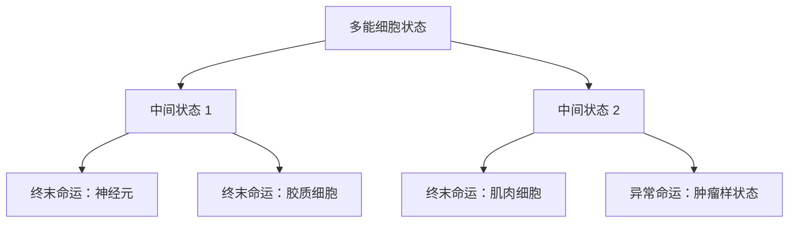

# 单细胞分化命运场：面向 Wavefront 复用的综述

## 摘要

单细胞分化命运场研究的是：在发育、再生、肿瘤演化或细胞重编程中，一个细胞当前处于什么状态，将来更可能走向哪种终末命运。现代单细胞 RNA 测序可以一次测量成千上万个细胞的基因表达，但通常是破坏性测量：一个细胞被测了，就不能继续追踪它未来如何变化。因此，领域内发展出 pseudotime、RNA velocity、CellRank、Palantir、Waddington-OT 等方法，从静态或多时间点数据中重建细胞状态转移图和命运概率。

这类问题天然适合 wavefront 的“全局场复用”思路。图中的节点是细胞状态，边表示状态间可能转移，目标是终末细胞类型或病理状态。一次从某个终末命运反向发放 wavefront，就能为所有中间细胞状态生成到该命运的 arrival-time / next-hop field；多目标 wavefront 还能比较多个终末命运的竞争吸引关系。这比城市导航更像科学问题，因为它直接连接发育生物学、再生医学、肿瘤异质性、干细胞分化和细胞治疗。

## 直观图像：从局部速度到全局命运概率


图源：Lange et al., [CellRank for directed single-cell fate mapping](https://www.nature.com/articles/s41592-021-01346-6), Nature Methods, 2022，Fig. 1。该论文为开放获取，许可为 [CC BY 4.0](https://creativecommons.org/licenses/by/4.0/)。图中展示了 CellRank 如何把 RNA velocity 与细胞相似性结合，构造有向转移矩阵，再粗粒化为宏状态，并计算每个细胞到不同 terminal state 的命运概率。

对计算机专业来说，这张图可以翻译为：

- 高维点云：每个点是一个细胞，每个坐标是某个基因或低维嵌入特征。
- KNN 图：相似细胞之间连边。
- RNA velocity：给每个细胞一个局部方向，表示基因表达正在朝哪里变化。
- 转移矩阵：把相似性和方向合成 `P(cell_i -> cell_j)`。
- 终末状态：图中的吸收区域或高稳定宏状态。
- 命运概率：从当前节点最终到达每个终末状态的概率。

你的 wavefront 方法可以在这里扮演“快速构建全局目标场”的角色。

## 背景：为什么单细胞命运推断重要

多细胞生物从一个受精卵发育成具有多种组织和器官的个体，本质上是细胞状态不断分化、分支和稳定化的过程。癌症、损伤修复、免疫反应、干细胞治疗也都涉及细胞状态转移。

传统 bulk RNA-seq 只能测混合细胞群的平均表达，容易掩盖稀有细胞类型和连续分化状态。单细胞 RNA-seq 解决了这个问题：每个细胞都有自己的表达向量。但它带来新问题：

- 数据是快照：多数 scRNA-seq 实验不能持续追踪同一个细胞。
- 数据维度很高：上万个基因，细胞数可达几万到几百万。
- 分化不是离散跳变：细胞状态通常连续变化，并存在中间状态。
- 命运选择是概率过程：一个早期细胞可能还没有完全承诺到某个终末命运。
- 方向性难以确定：仅靠相似性图知道谁和谁像，但不知道变化方向。

因此，领域内的核心问题是：

- 如何从静态点云重建发育轨迹？
- 如何判断轨迹方向？
- 如何找到初始、中间和终末细胞群？
- 如何计算每个细胞走向不同终末命运的概率？
- 如何识别驱动某条命运分支的关键基因？

这些问题都可以图论化。

## Waddington 景观：细胞命运的地形隐喻

Waddington 的 epigenetic landscape 把细胞分化想象成小球从山顶滚入不同山谷。山谷代表稳定细胞类型，山脊代表命运分叉和能垒。这个隐喻非常适合与你的 wavefront 连接：



如果把山谷看成终点，把山脊高度看成代价，那么从某个终末山谷反向传播 wavefront，就能得到整张地形上“每个位置该往哪里走才最容易到达该终末命运”的方向场。多目标 wavefront 则对应多个山谷同时竞争。

## 现有研究主线

### 1. Pseudotime：从静态细胞点云恢复先后顺序

Monocle 是早期代表方法之一。Trapnell 等人在 Nature Biotechnology 论文中提出用单细胞 RNA-seq 对细胞沿分化进程排序，恢复 pseudotime，并用于发现肌母细胞分化中的基因表达波和调控因子。pseudotime 的核心思想是：虽然每个细胞只被测了一次，但如果样本中包含许多处于不同阶段的细胞，就可以把这些细胞按相似性和轨迹结构排成一个“伪时间序列”。

计算机视角：

```text
输入：细胞表达矩阵 X[n_cells, n_genes]
降维：PCA / diffusion map / UMAP
建图：KNN 或最小生成树
排序：从指定 root cell 沿轨迹计算 pseudotime
输出：每个细胞的进程坐标
```

局限是方向和起点通常需要先验知识，且很难表达一个细胞对多个终末命运的概率分配。

### 2. Diffusion pseudotime：用扩散距离处理分支轨迹

Diffusion pseudotime 通过 diffusion map 捕捉细胞状态流形上的连通结构，对噪声和分支更稳健。它把细胞状态变化视为流形上的扩散过程，用扩散距离表示状态之间的发育接近程度。

对 wavefront 来说，diffusion distance 可作为边权或状态相似性的一部分；如果再引入方向性，就能从“无向扩散图”变成“有向命运图”。

### 3. RNA velocity：给细胞状态图加入方向

La Manno 等人在 2018 年提出 RNA velocity。其核心是区分未剪接 RNA 和已剪接 RNA，从而估计基因表达状态的时间导数。论文指出，RNA velocity 是一个高维向量，可预测单个细胞未来数小时尺度上的状态变化。

这对图模型很关键：KNN 图只告诉我们哪些细胞相似，RNA velocity 告诉我们更可能从哪个细胞走向哪个邻居。

简化公式可以理解为：

```text
cell_i 有速度向量 v_i
neighbor_j 与 cell_i 的表达差向量为 delta_ij
如果 delta_ij 与 v_i 方向一致，则 P(i -> j) 更高
```

### 4. scVelo：处理 transient state 的动力学模型

原始 RNA velocity 常依赖稳态假设。Bergen 等人的 scVelo 使用完整剪接动力学的似然模型，处理发育和扰动中常见的 transient cell states，并可估计转录、剪接和降解速率。它使 RNA velocity 更适合真实复杂数据。

对你的场景来说，scVelo 可以提供更可靠的局部方向向量，后续再构建图和 wavefront field。

### 5. Palantir：概率命运和细胞可塑性

Palantir 将细胞命运视为概率过程，为每个细胞分配到不同终末状态的概率，并用 entropy 表示细胞可塑性。它强调早期细胞可能同时保留多条分支潜能，分化过程中逐渐丧失可塑性并承诺到某个命运。

Palantir 与 wavefront 的关系是：Palantir 已经在做全局命运概率，wavefront 可以做的是另一类全局场，即最小代价/最早到达/next-hop 路径场。两者可以互补：

- Palantir：输出概率命运分布。
- Wavefront：输出到某个终末命运的代价场和路径场。

### 6. CellRank：有向 Markov chain 与全局命运图

CellRank 是和你最相关的现有研究之一。它把 RNA velocity 和细胞相似性合成有向转移矩阵，并将细胞状态动力学表示为 Markov chain。随后它识别 initial、intermediate、terminal macrostates，并计算每个细胞到不同终末群体的 fate probabilities。

这和你的 SNN 设定非常接近：

| CellRank 概念 | Wavefront/SNN 对应 |
| --- | --- |
| cell-cell transition matrix | 有向带权图 |
| terminal macrostates | 目标节点/目标集合 |
| fate probability | 到目标的概率性吸引强度 |
| coarse-grained macrostates | 状态图的粗粒化节点 |
| velocity kernel | 有向边权来源 |
| global fate map | 全局目标场 |

区别在于 CellRank 主要求的是概率吸收问题，通常通过线性系统或 Markov chain 分析求解；你的 wavefront 主要求的是 arrival-time / lowest-cost / next-hop field，更强调一次传播服务大量查询。

### 7. Waddington-OT 与 optimal transport

Waddington-OT 和后续 global Waddington-OT 把不同时间点的细胞群看作概率分布，用最优传输估计细胞群从早期到晚期如何流动。它适合有多时间点采样的数据，能够恢复 population-level trajectories。

它对 wavefront 场景的启发是：如果你有多个时间点的单细胞数据，可以用 optimal transport 估计边权或方向，再用 wavefront 在构建好的状态图上做多目标/多用户查询。

## Wavefront 如何嵌入单细胞命运场

给定有向图 `G=(V,E)`：

- `V`：细胞或细胞状态簇；
- `E`：KNN 邻居关系 + velocity/OT 方向；
- `P(i,j)`：从状态 i 转移到状态 j 的概率；
- `cost(i,j) = -log P(i,j)` 或其他势垒代价；
- `targets`：终末细胞类型，例如 alpha/beta/delta/endocrine fate，或肿瘤耐药状态。

反向 wavefront：

```text
reverse_G = reverse(G)
for target_fate in terminal_fates:
    field[target_fate] = SNN_Wavefront(reverse_G, target_fate)

for cell in all_cells:
    nearest_fate = argmin_target field[target].arrival_time[cell]
    path_to_fate = FollowNextHop(field[nearest_fate], cell)
```

如果只关心一个终末命运，例如 beta cell fate，那么一次 wavefront 就能服务所有细胞状态。若有多个终末命运，可以：

- 每个目标命运各跑一次 wavefront，得到多张目标场；
- 或使用多目标 wavefront，让多个终末状态同时竞争，最早到达的目标就是该细胞的最低代价命运。

## 最适合展示优势的科学问题

### 场景 A：胰腺内分泌细胞分化

CellRank 论文中使用了小鼠胰腺发育数据，涉及 alpha、beta、epsilon、delta 等终末命运。这个场景非常适合，因为它有多个 terminal fates、明确的中间 progenitor 状态，而且已有成熟文献可对照。

可做实验：

- 使用公开 pancreas scRNA-seq + RNA velocity 数据；
- 构建有向细胞状态图；
- 对每个 terminal fate 运行一次 SNN wavefront；
- 让所有细胞查询到各终末命运的代价和 next-hop；
- 与 Dijkstra/A* 多次单对单查询比较耗时；
- 与 CellRank fate probabilities 比较趋势一致性。

### 场景 B：造血干细胞命运分叉

造血系统是单细胞轨迹推断的经典场景。早期 hematopoietic stem/progenitor cell 可以分化为红细胞、髓系、淋巴系等多个方向。

优势点：

- 多目标：多个血细胞谱系终点。
- 多用户：所有中间细胞状态都要查询自己的命运路径。
- 科学意义强：干细胞分化、白血病、免疫系统发育。

### 场景 C：细胞重编程路径优化

细胞重编程中，研究者希望把一种成熟细胞转化为另一种目标细胞，例如 fibroblast 到 induced pluripotent stem cell。不是所有细胞都成功，有些会进入失败或异常状态。

Wavefront 场景：

- 目标：成功重编程状态。
- 起点：大量不同阶段的细胞。
- 边阻断：模拟敲除某个转录因子或药物扰动后某些转移不可用。
- 输出：哪些中间状态最接近成功路径，哪些状态应避免。

### 场景 D：肿瘤耐药命运场

肿瘤细胞在治疗压力下可能向耐药、休眠、迁移、免疫逃逸等状态转移。终末目标可以设为“耐药状态”或“可治疗敏感状态”。

Wavefront 可用于：

- 从耐药状态反向构建风险场；
- 查询所有肿瘤细胞状态到耐药状态的最低代价路径；
- 识别早期高风险中间状态；
- 模拟药物组合关闭某些状态转移边后的路径重排。

这个场景很适合写成高价值医学应用，但需要谨慎：真实临床解释必须结合实验验证。

## 可落地 Demo 设计

### 第一层：合成分化树

构造一个二维或三维潜空间，含有一个初始 basin、多个分叉和多个 terminal basins。每个节点有一个 velocity vector，边权由方向一致性和距离决定。

优点是可控，能清晰展示：

- 单目标多细胞查询；
- 多目标命运竞争；
- 局部扰动后重新发 wavefront；
- Dijkstra/A* 调用次数随细胞数线性增长，而 SNN wavefront 次数固定。

### 第二层：公开 pancreas 或 hematopoiesis 数据

使用公开 scVelo/CellRank tutorial 数据更真实。此时可以复用已有 preprocessing：

```text
scRNA-seq counts -> PCA/UMAP -> KNN graph
spliced/unspliced counts -> RNA velocity
KNN + velocity -> directed transition graph
terminal states -> target nodes
SNN wavefront -> next-hop field
```

### 第三层：扰动/重编程场景

引入 perturbation：

- 删除某些边：模拟转录因子敲除导致某条转移通道不可达；
- 提高边权：模拟药物使某条命运通道变难；
- 添加目标：模拟新增异常命运或治疗目标；
- 多次查询：同一图上服务上千细胞状态。

## 评价指标

算法指标：

- wavefront 次数；
- Dijkstra/A* 调用次数；
- 总规划耗时；
- 每个细胞平均回溯耗时；
- 查询数从 1 到 10000 增长时的时间曲线；
- 局部扰动后的增量重算成本。

生物解释指标：

- 与 CellRank fate probability 的相关性；
- 终末命运分类准确率；
- 已知 marker gene 的趋势一致性；
- 已知 lineage tree 的拓扑一致性；
- 关键中间状态是否符合文献；
- 扰动后预测路径是否符合实验或已有结论。

## 与当前 SNN 方法的对应关系

| 当前导航概念 | 单细胞命运场对应概念 |
| --- | --- |
| 地图节点 | 单个细胞 / 细胞状态簇 |
| 道路边 | 可能的状态转移 |
| 道路长度 | 转移代价、`-log P`、发育势垒 |
| 起点 | 当前细胞状态 |
| 终点 | 终末细胞类型 / 病理状态 |
| 拥塞/封路 | 基因扰动、药物阻断、不可达转移 |
| wavefront | 目标命运反向传播的到达时间场 |
| STDP parent trace | 每个状态的 next-hop fate route |
| 多用户 | 所有细胞共享同一目标命运场 |
| 多目标 | 多个终末命运同时竞争 |

## 风险与边界

这个方向的风险在于生物解释不能只靠最短路径。细胞命运是概率性的、受噪声和实验批次影响，而且 scRNA-seq 是快照数据。SNN wavefront 不能替代 CellRank、Palantir、RNA velocity 或 optimal transport 这类领域方法；更合理的定位是：

- 使用领域方法构建可信的有向状态图；
- 在该图上用 SNN wavefront 快速生成全局路径场；
- 重点展示“多细胞、多目标、多扰动查询”中的复用优势；
- 生物结论需要与 marker gene、fate probability、实验扰动结果交叉验证。

## 结论

单细胞分化命运场是比城市导航更适合展示 wavefront 复用优势的应用场景。它天然包含大量查询对象：每个细胞都是一个潜在起点，每个终末细胞类型都是一个目标；同一张状态转移图可以被反复查询、扰动和比较。你的 SNN wavefront 可以被表述为“在有向细胞状态图上快速构建 terminal-fate next-hop field 的事件驱动方法”，与现有 CellRank/Palantir/RNA velocity 方法形成互补。

如果要选择一个最优先 demo，我建议从“胰腺内分泌分化”或“造血分化”开始，因为这两个领域公开数据多、文献成熟、命运分支清晰，容易评估结果是否合理。

## 参考文献与资料

- Trapnell, C. et al. [The dynamics and regulators of cell fate decisions are revealed by pseudotemporal ordering of single cells](https://www.nature.com/articles/nbt.2859), Nature Biotechnology, 2014.
- La Manno, G. et al. [RNA velocity of single cells](https://www.nature.com/articles/s41586-018-0414-6), Nature, 2018.
- Bergen, V. et al. [Generalizing RNA velocity to transient cell states through dynamical modeling](https://www.nature.com/articles/s41587-020-0591-3), Nature Biotechnology, 2020.
- Setty, M. et al. [Characterization of cell fate probabilities in single-cell data with Palantir](https://www.nature.com/articles/s41587-019-0068-4), Nature Biotechnology, 2019.
- Lange, M. et al. [CellRank for directed single-cell fate mapping](https://www.nature.com/articles/s41592-021-01346-6), Nature Methods, 2022.
- Lavenant, H. et al. [Towards a mathematical theory of trajectory inference](https://arxiv.org/abs/2102.09204), arXiv, 2021.
- Ponulak, F. and Hopfield, J. J. [Rapid, parallel path planning by propagating wavefronts of spiking neural activity](https://arxiv.org/abs/1205.0335), arXiv, 2012.
