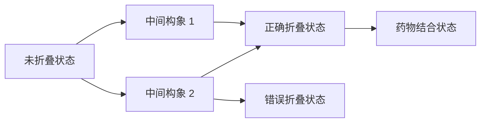
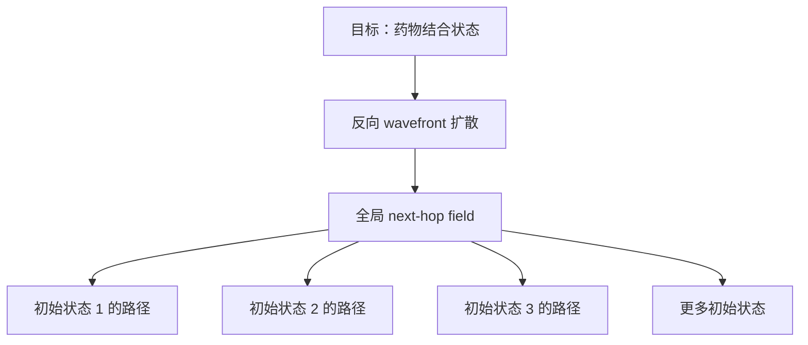
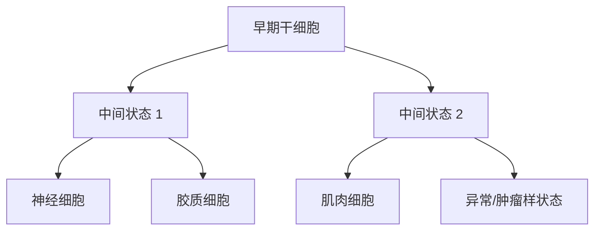
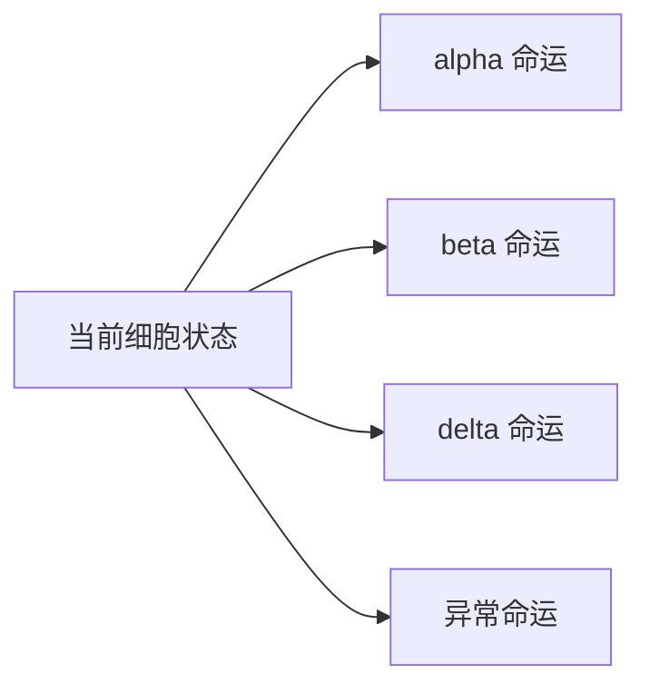

# Wavefront 科学应用场景通俗版

这份文档是前面两篇综述的通俗版。目标不是把你变成生物学或化学专家，而是让你能用计算机专业的视角理解：为什么“蛋白质构象路径场”和“单细胞分化命运场”适合作为 SNN wavefront 的应用级优势场景。

如果只记住一句话：

> 这两个问题都可以看成“很多对象在同一张复杂状态地图上，反复查询如何到达某个目标状态”。这种情况下，一次 wavefront 生成全局 next-hop field，比每个对象单独跑一次路径算法更适合展示优势。

## 先把核心类比讲清楚

你现在做的导航实验里有这些概念：

| 导航里的概念 | 更抽象的说法 |
| --- | --- |
| 地图节点 | 一个状态 |
| 道路 | 状态之间可以转移 |
| 路程/耗时 | 转移代价 |
| 起点 | 当前状态 |
| 终点 | 目标状态 |
| 路线 | 状态变化路径 |
| wavefront | 从目标或起点扩散出的全局到达场 |
| next-hop field | 每个状态下一步该往哪里走 |

城市导航只是这个抽象问题的一种生活化例子。更“高端”的科学问题也可以这样建模：

- 分子会在很多构象状态之间跳来跳去；
- 细胞会在很多发育状态之间逐步变化；
- 大脑信号会在很多脑区之间传播；
- 光会在很多散射路径之间传播。

这些问题不一定叫“导航”，但本质上都有“状态图 + 目标 + 路径/传播场”。

## 场景一：蛋白质构象路径场

### 1. 这到底是什么问题？

蛋白质不是一个静止的三维雕塑。它像一团非常复杂、会抖动、会折叠、会变形的分子机器。

比如一个蛋白质可能有几种状态：

- 松散状态；
- 半折叠状态；
- 正确折叠状态；
- 错误折叠状态；
- 和药物结合之前的状态；
- 和药物结合之后的状态；
- 被激活的状态；
- 没被激活的状态。

这些状态之间可以互相转换，但不是随便转换。有些转换容易，有些转换很难，有些几乎不可能。

你可以把它想成下面这张状态图：



这里的每个节点不是路口，而是“分子的一种形状”。每条边不是道路，而是“分子从一种形状变成另一种形状的可能性”。

### 2. 为什么这个问题重要？

因为蛋白质的形状决定功能。

举几个直观例子：

- 药物为什么能起作用？因为它能和蛋白质某个形状稳定结合。
- 有些疾病为什么发生？因为蛋白质错误折叠，进入了有害状态。
- 有些酶为什么能催化反应？因为它会在不同构象之间切换。
- 有些受体为什么被激活？因为它从 inactive state 变成 active state。

所以科学家很关心：

- 一个蛋白质怎么从状态 A 变成状态 B？
- 哪些中间状态最关键？
- 药物会不会改变这条路径？
- 哪些状态最容易走向有害错误折叠？

这些问题如果翻译成计算机语言，就是在一个复杂图上做路径和目标场分析。

### 3. 传统方法大概在做什么？

真实分子运动非常快，也非常复杂。科学家常用分子动力学模拟，简单说就是：

> 用物理公式一步一步模拟原子的运动。

但问题是，真正重要的事件很少发生。分子可能抖动了很久，才偶尔跨过一个能量障碍，进入另一个状态。

所以科学家通常会把大量模拟轨迹整理成一个“状态图”：

```text
状态 1 -> 状态 2 的概率是多少？
状态 2 -> 状态 5 的概率是多少？
状态 5 -> 药物结合状态的代价是多少？
```

这类方法中很重要的一种叫 Markov State Model，简称 MSM。你不需要掌握它的数学细节，只要理解：

> MSM 的作用是把复杂分子运动整理成一张“构象状态转移图”。

一旦有了这张图，你的 wavefront 方法就有用武之地了。

### 4. Wavefront 在这里怎么用？

假设目标是“药物稳定结合状态”。

现在有很多初始状态：

- 配体刚靠近蛋白质的状态；
- 配体在入口处的状态；
- 配体半进入口袋的状态；
- 蛋白质不同形变下的状态；
- 不同突变体对应的状态。

传统单对单路径算法会这样做：

```text
起点 1 -> 目标：跑一次 Dijkstra/A*
起点 2 -> 目标：再跑一次 Dijkstra/A*
起点 3 -> 目标：再跑一次 Dijkstra/A*
...
```

Wavefront 更像这样：

```text
从目标状态反向发放一次 wavefront
生成整张图上每个状态到目标的 next-hop field
所有起点只需要沿这个 field 回溯
```

也就是：



这正好对应你已经验证过的“多个用户共享同一个目标场”。

### 5. 更适合写进论文的应用故事

比较推荐的故事是：

> 在药物设计中，一个蛋白质-配体系统可能存在大量候选初始构象和中间构象。我们将构象状态建模为带权图，目标是稳定结合态。SNN wavefront 从目标态反向传播，一次生成全局构象 next-hop field，从而同时服务大量初始构象到目标态的路径查询。

这个故事比城市导航更高级，因为它连接了：

- 药物设计；
- 蛋白质折叠；
- 分子动力学；
- 稀有事件采样；
- 复杂状态空间搜索。

### 6. 最容易做的 demo

不建议一开始就做真实蛋白质，太复杂。可以分三步：

1. 先做一个二维“能量地形”模拟。
   - 节点是二维网格点；
   - 低能量区域代表稳定构象；
   - 高能量区域代表障碍；
   - 目标是某个稳定区域。

2. 再做一个小分子 toy model。
   - 比如 alanine dipeptide 这种经典教学系统；
   - 用二维角度空间表示构象；
   - 构建状态图。

3. 最后再接真实 MSM 数据。
   - 使用公开分子动力学数据；
   - 构建状态转移图；
   - 跑多起点、多目标 wavefront 实验。

## 场景二：单细胞分化命运场

### 1. 这到底是什么问题？

人的身体里有很多种细胞：

- 神经元；
- 肌肉细胞；
- 血细胞；
- 免疫细胞；
- 肝细胞；
- 肿瘤细胞。

但它们最早都可以追溯到更原始、更“未决定”的细胞状态。一个细胞会随着发育逐渐走向某种命运。

你可以把它想成：



这里的“路线”不是汽车走路，而是细胞状态变化。

### 2. 为什么这个问题重要？

因为它关系到很多生命科学和医学问题：

- 干细胞如何变成特定细胞？
- 癌细胞如何走向耐药状态？
- 免疫细胞如何变成有效杀伤状态？
- 受伤组织如何再生？
- 如何把一种细胞重编程成另一种细胞？

科学家希望知道：

- 当前这个细胞更可能走向哪个命运？
- 它距离某个目标细胞类型还有多远？
- 中间要经过哪些状态？
- 如果阻断某个基因调控路径，命运会不会改变？

这些问题也可以变成图问题。

### 3. 单细胞数据是什么？

现在有一种技术叫单细胞 RNA 测序。你可以把它理解成：

> 给每个细胞拍一张“基因表达快照”。

每个细胞可以表示成一个高维向量：

```text
cell_i = [gene_1 表达量, gene_2 表达量, ..., gene_20000 表达量]
```

如果两个细胞的基因表达很像，就说明它们状态接近。于是可以建一张细胞状态图：

```text
细胞 A 和细胞 B 很像 -> 连边
细胞 B 和细胞 C 很像 -> 连边
```

但光知道“像不像”还不够，因为我们还想知道方向：细胞是从 A 变到 B，还是从 B 变到 A？

这时候会用到 RNA velocity。你可以把它理解成：

> 给每个细胞估计一个“未来变化方向”。

所以单细胞命运图大概是：

```text
节点：细胞状态
边：可能的状态变化
方向：由 RNA velocity 或时间信息估计
边权：变化难度、概率或代价
目标：某种终末细胞类型
```

### 4. Wavefront 在这里怎么用？

假设目标是“成熟的 beta 细胞”。beta 细胞和胰岛素分泌有关，是糖尿病研究中的重要细胞类型。

现在我们有成千上万个细胞状态：

- 有些是早期干细胞；
- 有些是中间状态；
- 有些接近 alpha 细胞；
- 有些接近 beta 细胞；
- 有些可能走向其他命运。

如果我们想知道“每个细胞如何走向 beta 细胞”，传统单对单路径算法会重复很多次：

```text
细胞 1 -> beta：跑一次路径规划
细胞 2 -> beta：跑一次路径规划
细胞 3 -> beta：跑一次路径规划
...
```

Wavefront 则是：

```text
从 beta 细胞状态反向发放一次 wavefront
得到所有细胞状态到 beta 的 next-hop field
每个细胞直接查 field 就知道下一步朝哪里走
```

这和你的“多个用户共享同一目标场”完全对应，只是用户变成了细胞。

### 5. 多目标版本更自然

单细胞分化还有一个特点：一个早期细胞可能有多个未来命运。

比如一个细胞可能变成：

- alpha 细胞；
- beta 细胞；
- delta 细胞；
- 异常状态。

这就对应你实验里的“多目标同时搜索”：



如果多个目标命运同时发放 wavefront，哪个 wavefront 最早到达某个细胞，就说明这个细胞在当前代价定义下更接近哪个命运。

当然，真实生物学里不能只看最短路径，还要看概率和实验验证。但作为算法 demo，这个设定非常清楚。

### 6. 更适合写进论文的应用故事

推荐故事：

> 在单细胞发育数据中，每个细胞状态都是图上的一个节点，RNA velocity 或时间序列信息定义有向边。终末细胞类型被视为目标状态。SNN wavefront 可以从一个或多个终末命运反向传播，一次构建全局命运 next-hop field，从而服务所有细胞状态的命运路径查询。

这个故事比城市导航更高级，因为它连接了：

- 单细胞 RNA 测序；
- 发育生物学；
- 干细胞分化；
- 肿瘤耐药；
- 细胞重编程；
- 大规模有向状态图分析。

### 7. 最容易做的 demo

也建议分三步：

1. 合成分化树。
   - 自己生成一个带分叉的二维点云；
   - 每个点代表细胞状态；
   - 设置几个终末命运；
   - 用 wavefront 做多目标/多细胞查询。

2. 用公开教程数据。
   - 比如 pancreas 数据或 hematopoiesis 数据；
   - 这些是单细胞命运推断领域常见数据集；
   - 可以借助现有工具得到细胞图。

3. 加入扰动。
   - 删除一些边，模拟某个基因被敲除；
   - 提高一些边权，模拟药物阻断；
   - 看 wavefront 重新生成的命运场如何变化。

## 两个方向怎么选？

| 维度 | 蛋白质构象路径场 | 单细胞分化命运场 |
| --- | --- | --- |
| 直观程度 | 中等，需要理解分子构象 | 更直观，细胞分化像命运树 |
| 和图算法的关系 | 很强，MSM 本身就是状态转移图 | 很强，KNN/velocity graph 很常见 |
| 数据获取难度 | 中等到高 | 中等，公开教程数据较多 |
| 可视化效果 | 能量地形、构象路径 | 分化树、命运分支、细胞点云 |
| 论文故事高级感 | 药物设计、蛋白质折叠 | 发育生物学、肿瘤耐药、干细胞 |
| 推荐优先级 | 第二阶段 | 第一阶段 |

如果目标是尽快做出一个说服力强、比较容易讲清楚的 demo，我更推荐先做单细胞分化命运场。

原因是：

- 细胞分化本身就是“从起点走向多个终点”的故事；
- 多目标命运竞争非常自然；
- 成千上万个细胞共享同一目标命运场也很自然；
- UMAP/点云图容易可视化；
- 公开数据和现成工具更多。

蛋白质构象路径场更适合作为第二个高端方向，因为它更贴近药物设计，但背景知识门槛更高。

## 最终可以怎么写进你的研究叙事

可以这样组织：

1. 单次点对点路径规划中，SNN wavefront 不一定比 Dijkstra/A* 有优势。
2. 但在科学计算中，很多问题不是单次点对点查询，而是大量状态共享同一个目标场。
3. SNN wavefront 的自然输出就是全局 arrival-time field 和 next-hop field。
4. 当有很多起点、很多候选目标或多次扰动时，一次 wavefront 可被大量复用。
5. 单细胞命运推断和蛋白质构象转移都是这类问题的代表。

更简洁的论文表述：

> 我们不把 SNN wavefront 定位为传统最短路算法在单次查询上的替代品，而是定位为一种面向复杂状态空间的全局路径场生成机制。其优势出现在多起点、多目标和重复查询场景中，例如单细胞命运推断中的 terminal-fate field，以及分子构象网络中的目标构象路径场。

## 术语小词典

| 术语 | 通俗解释 |
| --- | --- |
| 蛋白质构象 | 蛋白质的一种三维形状 |
| 配体 | 能和蛋白质结合的小分子，很多药物就是配体 |
| 分子动力学 | 用物理公式模拟原子如何运动 |
| Markov State Model | 把分子运动整理成状态转移图的方法 |
| 自由能地形 | 描述哪些分子状态稳定、哪些状态难到达的地形图 |
| 单细胞 RNA 测序 | 给每个细胞测量基因表达快照 |
| RNA velocity | 估计细胞未来变化方向的方法 |
| 细胞命运 | 一个细胞最终会变成哪种类型 |
| terminal state | 终末状态，比如成熟细胞类型或稳定构象 |
| next-hop field | 每个状态到目标状态的下一步推荐方向 |
| arrival-time field | wavefront 到达每个状态的时间/代价 |

